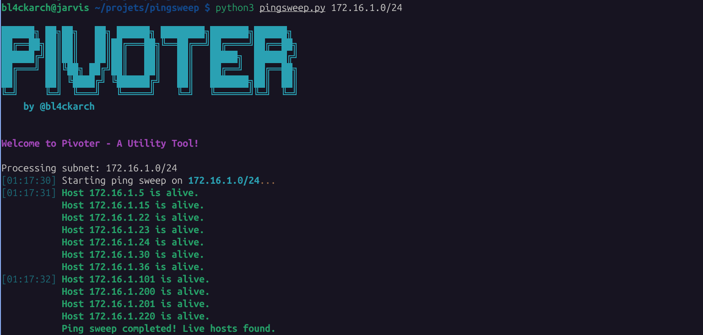
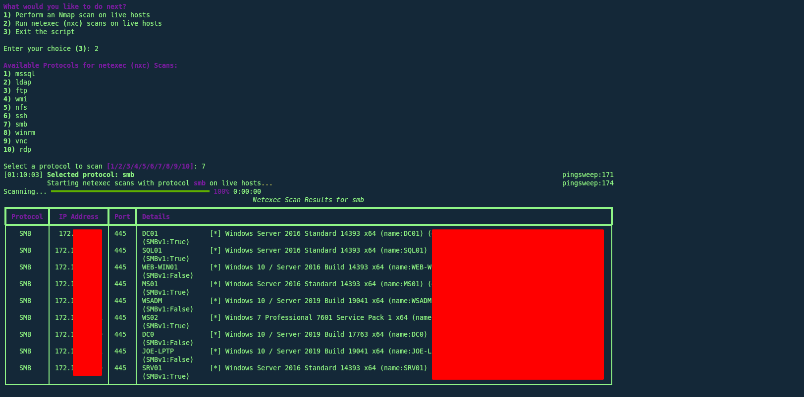

# Pivoter

**Pivoter** is a subnet scanning and pivoting tool designed to perform quick and efficient network reconnaissance. It combines several powerful utilities to identify live hosts, perform detailed Nmap scans, and run protocol-specific enumerations using `nxc`.

## Features

- **Ping Sweep**: Identify live hosts in a given subnet.
- **Nmap Scans**: Perform detailed asynchronous Nmap scans on identified live hosts.
- **Netexec (nxc) Scans**: Run protocol-specific scans (e.g., SMB, SSH, LDAP) on live hosts.
- **Interactive Menu**: Allows users to choose tasks sequentially without restarting the script.


## Installation

1. Clone the repository:
   ```bash
   git clone https://github.com/yourusername/pivoter.git
   cd pivoter
   ```

2. Install required Python dependencies:
   ```bash
   pip install rich
   ```

3. Ensure `nmap` and `nxc` are installed on your system.

## Usage

1. Run the script with the desired subnet:
   ```bash
   python pivoter.py <subnet>
   ```

   Example:
   ```bash
   python pivoter.py 192.168.1.0/24
   ```

2. Follow the interactive menu to perform tasks:
   - Ping Sweep
   - Nmap Scan
   - Protocol-specific scans with `nxc`

3. Exit the tool by selecting the `Exit` option.

## Example Output






## License

This project is licensed under the GPLv3.0 License.
